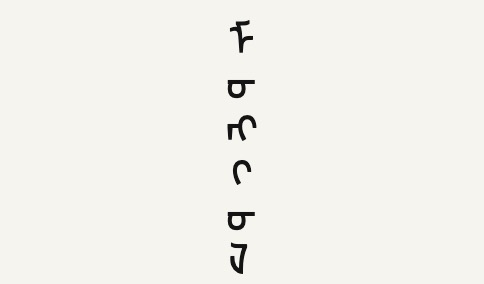
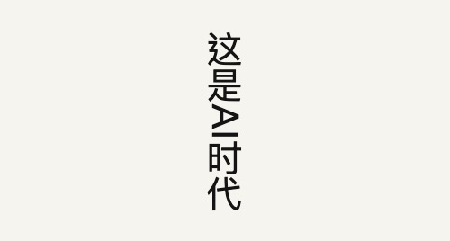
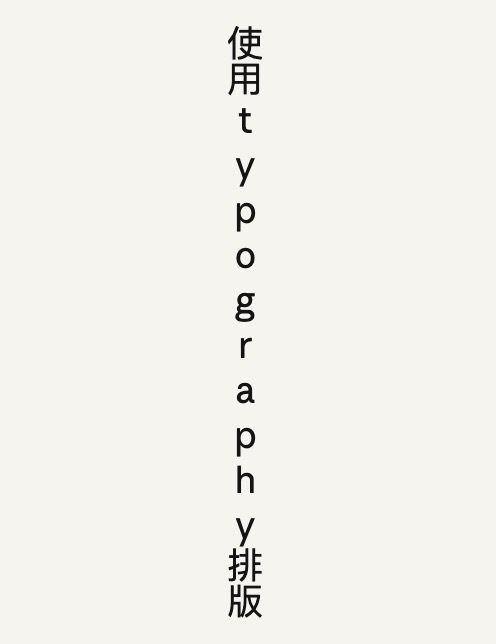
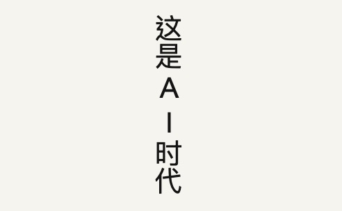
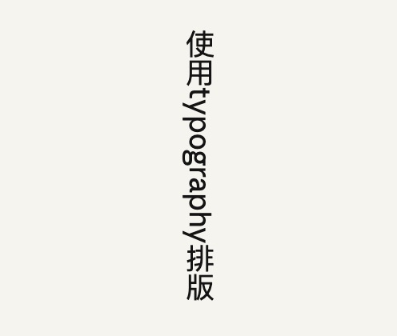
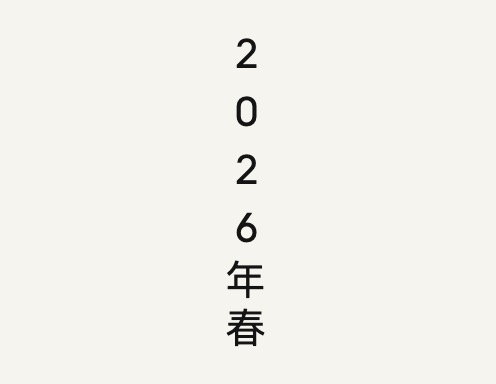
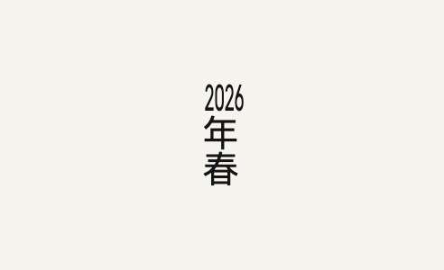

# 中文与多语言产品排版指南

[](https://creativecommons.org/licenses/by/4.0/)

> 不仅仅是加空格 —— 一份面向中文与多语言数字产品的排版与国际化工程实践指南。
>
> *More than just adding spaces — a practical typography & i18n guide for Chinese and multilingual digital products.*

从空格与标点出发，延伸到双向文本（BiDi）、横书竖书、CSS 逻辑属性等多语言产品中真正会遇到的工程问题。

- **作者**：[@liruiying728](https://x.com/liruiying728)
- **联系**：liruiying728@gmail.com
- **最近更新**：2026.05.04

如果这份文档对你有帮助，欢迎点 Star ⭐ — 这是对我最好的鼓励。

---

# 目录

- [前言](#前言)
- [面向受众](#面向受众)
- [图形说明](#图形说明)
- [一、空格的使用](#一空格的使用)
- [二、标点符号](#二标点符号)
- [三、正确书写](#三正确书写)
- [四、正确表达](#四正确表达)
- [五、约定俗成的错误表达](#五约定俗成的错误表达)
- [六、文字格式](#六文字格式)
- [七、文本方向](#七文本方向)
- [八、横书竖书](#八横书竖书)
- [九、技术实现](#九技术实现)
- [最后](#最后)
- [参考与引用](#参考与引用)
- [许可证](#许可证)

# 前言

这份文档最初只想解决一个问题——中西文混排时候文案美观度问题，当时的做法是参考了主流的「加空格」方案，但怎么加、要不要加是当时所面临的问题。

从这个问题出发，慢慢延伸出标点符号的选用、词义的辨析、文字格式的取舍，再到多语言产品中真正会遇到的工程问题——双向文本、横书竖书、CSS 实现。内容越积越多，就成了现在这份文档。

现有的中文排版讨论大多停留在空格和标点层面，这份文档试图往工程和多语言方向走得更远一些。

它不是严格意义上的规范，更像是一份 **倡议**：统一处理方式，不只是为了视觉整齐，也是对不同文化背景下读者的一份尊重。

> **提醒** 
>
> 文中存在部分特殊字符，可能因设备字体支持情况不同，出现豆腐块或留空，属正常现象。

# 面向受众

这份指南并非仅为文字工作者准备，它是多语言产品链路中各环节的共同语言，所以它的受众是：

- 内容创作者与编辑
- UI/UX 设计师，尤其是 UX Writer
- 前端与产品工程师
- AI 产品经理与开发者

> **提醒**
>
> 本文档的讨论基准与规范细节主要面向 **基于中国大陆的简体中文** 语境。虽涉及多语言国际化工程内容，但标点习惯、词义辨析及书写准则均以中国大陆现行标准为准。
>
> 排版是一个持续演进的过程。如您在繁体中文、日韩文或其他特定语言环境下有更深度的排版需求或修正建议，欢迎与我联系：
>
> - E-mail：liruiying728@gmail.com
> - X：https://x.com/liruiying728

# 图形说明

以下举例将有两个维度：

|        | 图形展示             | 说明                               |
| ------ | -------------------- | ---------------------------------- |
| 建议型 | 🔵 推荐<br />🟠 不推荐 | 出于美观、方便阅读考量而加上的要求 |
| 禁止型 | 🟢 正确<br />🔴 错误   | 禁止型是明确不符合规范的、错误的   |

# 一、空格的使用

加不加空格其实是一件非常主观化的事情，在网络上也有相当激烈的争论，加上不是一定比不加更好，从设计的角度出发，我希望提出一个统一化的「主观性」概念——**我们都要使用空格，让页面更有呼吸感**。

虽然 CSS 属性 `text-autospace: auto;` （[text-autospace](https://developer.mozilla.org/zh-CN/docs/Web/CSS/Reference/Properties/text-autospace)）试图从技术层面缓解，但受限于浏览器兼容性、不可控的间距比例（其默认的 0.125em 远小于常规空格的视觉呼吸感）以及无法自定义间距的限制，它目前仍无法完全取代人工或脚本的精细干预。

## 空格是什么以及有什么类别

空格是行文为防止混淆或有特定用途的空位。根据 [Unicode](https://zh.wikipedia.org/wiki/Unicode) 的定义，空格种类多达 21 种（详细可以查阅 [空格的定义](https://zh.wikipedia.org/wiki/%E7%A9%BA%E6%A0%BC) 或 [张鑫旭的文章《有用的空格们》](https://www.zhangxinxu.com/wordpress/2011/05/web%E9%A1%B5%E9%9D%A2%E7%9B%B8%E5%85%B3%E7%9A%84%E4%B8%80%E4%BA%9B%E5%B8%B8%E8%A7%81%E5%8F%AF%E7%94%A8%E5%AD%97%E7%AC%A6%E4%BB%8B%E7%BB%8D/)），我们只考虑常规下，键盘按下的「那个空格」，其余情况暂不考虑。

## 使用空格的情况

大体上讲，[全角与半角字符](https://zh.wikipedia.org/wiki/%E5%85%A8%E5%BD%A2%E5%92%8C%E5%8D%8A%E5%BD%A2) 相遇时候大多情况下需要加空格。在一些特定环境下，可以中文搭配英文符号使用，例如在产品用户名单中「乔丹 (飞人)」。

### 中文与英文之间

🟠 不推荐

```
Apple公司发布了新的iPhone手机。
```

🔵 推荐

```
Apple 公司发布了新的 iPhone 手机。
```

### 中文与数字之间

🟠 不推荐

```
新手机花了我10,000元。
```

🔵 推荐

```
新手机花了我 10,000 元。
```

### 中文、英文、数字混用

🟠 不推荐

```
Apple公司发布了iPhone12ProMax手机。
Apple公司发布了iPhone 12 Pro Max手机。
```

🔵 推荐

```
Apple 公司发布了 iPhone 12 Pro Max 手机。
```

### 正文 + 链接

🟠 不推荐

```
请[点击此处](/)提交您的意见反馈。
```

🔵 推荐

```
请 [点击此处](/) 提交您的意见反馈。
```

### 正文 + Emoji

🟠 不推荐

```
今天真不好彩，出门就踩到狗屎🐶💩还丢了十块钱💰。
```

🔵 推荐

```
今天真不好彩，出门就踩到狗屎 🐶💩 还丢了十块钱 💰。
```

### 正文夹杂代码块

🟠 不推荐

```
JavaScript 中的弹窗提示是不是alert();啊？
```

🔵 推荐

推荐代码部分使用代码块包裹，而不是单纯以文本形式出现。

```
JavaScript 中的弹窗提示是不是 `alert();` 啊？
```

### 英文中前后句子之间

🟠 不推荐

```
Wow!It's so beautiful,right?
```

🔵 推荐

```
Wow! It's so beautiful, right?
```

### 外来词汇

🟠 不推荐

```
韩语的再见是不是안녕？
```

🔵 推荐

```
韩语的再见是不是 안녕？
```

## 不使用空格的情况

### 品牌名称的固定搭配

🔴 错误

```
腾讯 QQ、360 安全卫士
```

🟢 正确

```
腾讯QQ、360安全卫士
```

### 中文域名下的邮箱

🔴 错误

```
zhangsan @ 网站名称 .com
```

🟢 正确

```
zhangsan@网站名称.com
```

### 特殊使用情况下，如 @某人

因为程序实现原因，如 @ 人、使用 # 标签中间有空格，程序会认为不执行 @ 或者 # 操作（利用此逻辑，要规避在使用场景下 @ 到人、打上标签，可以使用空格解决）。

🔴 错误

```
@ 张三
# macOS
```

🟢 正确

```
@张三
#macOS
```

### 有货币符号的 + 金额

有一部分 [货币符号](https://zh.wikipedia.org/wiki/%E8%B4%A7%E5%B8%81%E7%AC%A6%E5%8F%B7)（如：$、£、€、₨、₽、¥、د.ج、₪）后接的金额不需要加空格，无货币符号的（如：SGD、CHF、THB）后接金额需要加空格。如遇到负数的金额，负号写在最前面，负号与货币符号不留空格。

🔴 错误

```
AU$ 999.99
€ 999.99
¥ 999.99
UAH999.99
¥-999.99
UAH -999.99
```

🟢 正确

负号置于货币符号前。

```
AU$999.99
€999.99
¥999.99
UAH 999.99
-¥999.99
-UAH 999.99
```

### 数字与英文单位之间

🟠 不推荐

```
我新买的电脑容量是256GB，而且使用优惠还便宜了15%。
我新买的电脑容量是 256 GB，而且使用优惠还便宜了 15 %。
音速是指在空气中的速度为 343.2 m / s（1,236 km / h）。
```

🔵 推荐

```
我新买的电脑容量是 256GB，而且使用优惠还便宜了 15%。
音速是指在空气中的速度为 343.2m/s（1,236km/h）。
```

### 英文 + 全角符号

🟠 不推荐

```
国外的互联网大公司有Google、Apple、Amazon和Facebook。
国外的互联网大公司有 Google 、 Apple 、 Amazon 和 Facebook 。
```

🔵 推荐

```
国外的互联网大公司有 Google、Apple、Amazon 和 Facebook。
```

### 重复的标点符号

建议克制重复性使用标点符号，重复的标点符号之间不需要空格。

🟠 不推荐

```
天啊！！！好流畅好炫酷的动效啊！！！！！！
Amazing ! ! ! 这个女孩子好可爱的啊 ！ ！ ！
```

🔵 推荐

第二个例句主表述为中文语境，故「Amazing」后接中文标点符号。

```
天啊！好流畅好炫酷的动效啊！
Amazing！这个女孩子好可爱的啊！
```

# 二、标点符号

中文下使用全角符号，英文下使用半角符号。其中，中国大陆、香港、澳门、台湾甚至日本所使用的标点符号基本类似，区别比较细微，主要不同点是符号在全角区域内的摆放位置。

## 引号差异

引号是差异化比较大的，简单概述如下，更为详细规范请访问维基百科关于 [标点符号](https://zh.wikipedia.org/wiki/%E6%A0%87%E7%82%B9%E7%AC%A6%E5%8F%B7) 的详细介绍。

|      | 中国大陆      | 台湾 / 日本   | 香港 / 澳门 |
| ---- | ------------- | ------------- | ----------- |
| 横书 | `“ ‘ ’ ”`     | `「 『 』 」` | 无严格规范  |
| 纵书 | `﹃ ﹁ ﹂ ﹄` | `﹁ ﹃ ﹄ ﹂` | 无严格规范  |

因在某些字体下，豆点引号会形似英文半角下的引号 `" ' ' "`，一定程度上影响阅读与美观度。从更容易区分的角度来看，推荐使用块状引号 `「 『 』 」`。

## 使用块状引号

🟠 不推荐

```
我家的猫咪昨天居然冲我喊了一句"汪"！
```

🔵 推荐

```
我家的猫咪昨天居然冲我喊了一句「汪」！
```

## 正确嵌套符号

🔴 错误

```
Apple（苹果公司】总部在美国加州。
```

🟢 正确

```
Apple（苹果公司）总部在美国加州。
```

## 嵌套完整

🔴 错误

```
现在飞机飞行高度为一万米（约 32808 英尺。
```

🟢 正确

```
现在飞机飞行高度为一万米（约 32808 英尺）。
```

## 禁止出现在行首的符号 `，` `。` `、` `？` `！` `；` `：` `）` `〉` `》` `」` `』` `】` `〕` `”` `’` `·`

技术上，可以依靠 CSS 的 `line-break: strict;` 自动处理，不需要手动换行。

🔴 错误

```
这款产品的设计理念是「简单即是美
」，我们在每一个细节上都反复推敲。
```

🟢 正确

```
这款产品的设计理念是「简单即是美」，
我们在每一个细节上都反复推敲。
```

## 禁止出现在行尾的符号 `（` `〈` `《` `「` `『` `【` `〔` `“` `‘`

技术上，可以依靠 CSS 的 `line-break: strict;` 自动处理，不需要手动换行。

🔴 错误

```
详细内容请参考（
附录 A）的说明。
```

🟢 正确

```
详细内容请参考
（附录 A）的说明。
```

## 禁止被拆分在两行的符号 `……` `——`

CSS 里用 `word-break: keep-all;` 可以辅助避免，但这两个符号的拆分问题最终还是要靠排版引擎或手动处理。

🔴 错误

```
她站在窗边，望着窗外发呆…
…也许明天会不一样吧。
```

🟢 正确

```
她站在窗边，望着窗外发呆，
……也许明天会不一样吧。
```

## 避免使用下划线

互联网语言中，文字 + 下划线代表是一个链接，在日常使用中，不推荐使用下划线去强调文字，可以酌情使用 `【】`（详细请参阅「三、正确书写」中的「正确的『强调』」）。

🔵 推荐

```
我们 **明天九点** 出发！
```

## 中文句子中夹杂英文，句中、句尾使用中文符号

如果夹杂英语句子的，外面括号使用中文符号，句子内使用英文原句子符号。

🟠 不推荐

```
微软公司 (Microsoft) 近期发布了 Windows 11 系统。
Web 前端技术中最基础的当属 HTML, CSS 和 JavaScript.
我最喜欢越狱的一句台词是「Sucre：Why do you want to see him so hard anyway？Michael：Because he's my brother。」。
```

🔵 推荐

```
微软公司（Microsoft）近期发布了 Windows 11 系统。
Web 前端技术中最基础的当属 HTML、CSS 和 JavaScript。
我最喜欢越狱的一句台词是「Sucre: Why do you want to see him so hard anyway? Michael: Because he's my brother.」。
```

## 英语句子中夹杂中文，句中、句尾使用半角符号

🟠 不推荐

```
Bill Gates（比尔·盖茨）is an American business magnate.
```

🔵 推荐

此处的左右括号为英文半角的，因加上了空格，视觉上会有中文全角括号错觉。

```
Bill Gates (比尔·盖茨) is an American business magnate.
```

## 中文句子内夹有英文书籍名、报刊名时，不应借用中文书名号，应以英文斜体表示

不单单是英文书名、报刊名，还有英文歌曲、文章标题等，更多信息可查阅 [夹用英文的中文文本的标点符号用法(草案)](http://www.moe.gov.cn/ewebeditor/uploadfile/2015/01/13/20150113092346124.pdf)）。

🟠 不推荐

```
我刚买了一本新书《Don't Make Me Think》。
我喜欢 Michael Jackson 的「Heal The World」。
```

🔵 推荐

```
我刚买了一本新书 *Don't Make Me Think*。
我喜欢 Michael Jackson 的 *Heal The World*。
```

## 非汉族人名内部或书目使用间隔符「·」

[间隔号](https://zh.wikipedia.org/wiki/%E9%97%B4%E9%9A%94%E5%8F%B7) 用于某些非汉族人名内部或书目当中，它是由音界号（又叫分读号）演变而来；除了原有音界号的功用外，还加入了间隔书名与篇章的新功用。

🟠 不推荐

```
比尔盖茨、比尔 盖茨
《流星蝴蝶剑》、《流星 蝴蝶 剑》
```

🔵 推荐

```
比尔·盖茨
《流星‧蝴蝶‧剑》
```

## 乘号使用 × 而非英文字母的 X 或 x

考虑到 × 输入有点困难，可以酌情使用英文下的 `*` 代替，web 前端使用 `&times;`。

🟠 不推荐

```
6 X 4 = 24
```

🔵 推荐

```
6 × 4 = 24
6 * 4 = 24
```

## 省略号使用 `……` 而非 `...` 或 `…`

中文省略号由六个点组成，是两个三点省略号的连用 `……`。英文省略号 `...` 或单个三点 `…` 不应在中文语境下替代使用。

🔴 错误

```
她想了很久...最终还是没有开口。
这里有苹果、香蕉、橙子…
```

🟢 正确

```
她想了很久……最终还是没有开口。
这里有苹果、香蕉、橙子……
```

# 三、正确书写

## 正确的「强调」

### 英文环境下：斜体强调

推荐使用斜体（也称为 [意大利体](https://zh.wikipedia.org/wiki/%E6%84%8F%E5%A4%A7%E5%88%A9%E4%BD%93)），表示强调，唤起注意。

🟠 不推荐

```
You must read the terms before proceeding.
```

🔵 推荐

```
You *must* read the terms before proceeding.
```

### 中文环境下，无格式设置，酌情用 `【】`

🟠 不推荐

```
请注意，操作前务必备份数据。
```

🔵 推荐

```
请注意，操作前务必【备份数据】。
```

### 中文环境下，有格式设置，用加粗

🟠 不推荐

```
请注意，操作前务必【备份数据】。
请注意，操作前务必 *备份数据*。
```

🔵 推荐

```
请注意，操作前务必 **备份数据**。
```

### 中文环境下，格式设置自定义性强时，用 [着重号](https://zh.wikipedia.org/wiki/%E7%9D%80%E9%87%8D%E5%8F%B7)

🟠 不推荐

```
请注意，操作前务必备份数据。
请注意，操作前务必【备份数据】。
请注意，操作前务必 *备份数据*。
请注意，操作前务必 **备份数据**。
```

🔵 推荐

着重号是印在文字正下方的圆点，一字一点，是中文传统的强调方式。在 CSS 里用 `text-emphasis: filled circle;` 实现，Web 端支持良好，但很多富文本编辑器不支持，所以才有「格式设置自定义性强时」这个前提。

## 专有名词应按照其本身产品名称规定来

不可以随意更改大小写、添加删除空格、缩写扩写等。

🔴 错误

```
Iphone、IPhone、iphone、ip
1080 P
```

🟢 正确

```
iPhone
1080p
```

## 中文句子内夹杂英文单词或词组，首字母一律小写

特殊需要大写的除外，不管英文是在句首、句中还是句尾，首字母都是小写（更多内容可查阅 [中华人民共和国新闻出版行业标准 CY T154—2017 中文出版物夹用英文的编辑标准](http://sxqx.alljournal.cn/uploadfile/sxqx/20190304/CY%20T154%E2%80%942017%20%E4%B8%AD%E6%96%87%E5%87%BA%E7%89%88%E7%89%A9%E5%A4%B9%E7%94%A8%E8%8B%B1%E6%96%87%E7%9A%84%E7%BC%96%E8%BE%91%E6%A0%87%E5%87%86.pdf)）。

🔴 错误

```
Paper 可以构成合成词，如 paperboard、notepaper 等。
他们为什么把「卫生间」叫做 Restroom？
nba 全称是 National Basketball Association。
```

🟢 正确

```
paper 可以构成合成词，如 paperboard、notepaper 等。
他们为什么把「卫生间」叫做 restroom？
NBA 全称是 National Basketball Association。
```

## 特殊名词置于句首不更改其名字大小写

🔴 错误

```
IPhone 用起来好流畅。
```

🟢 正确

```
iPhone 用起来好流畅。
```

## 非特殊情况下不使用 [二简字](https://zh.wikipedia.org/zh/%E4%BA%8C%E7%AE%80%E5%AD%97)、[异体字](https://zh.wikipedia.org/zh/%E5%BC%82%E4%BD%93%E5%AD%97)

🔴 错误

```
快歺
一羣羊
```

🟢 正确

```
快餐
一群羊
```

## 正确使用「啊」与「阿」

我们只针对发 a 或者 ā 音的进行讨论，其它发音不在讨论范围内。

- 「[啊](https://zh.wikipedia.org/wiki/%E5%95%8A)」字表感叹，一般用于句尾，因语调不同而可能表示惊讶、赞叹、疑问或肯定。
- 「[阿](https://www.zdic.net/hans/%E9%98%BF)」字一般加在称谓、名字等之前，有亲昵的意味。

🔴 错误

```
天阿！这是真的吗？
啊颖昨天捡到了一百块钱。
```

🟢 正确

```
天啊！这是真的吗？
阿颖昨天捡到了一百块钱。
```

## 正确使用「的」、「地」、「得」

我们只针对发 de、děi 音的进行讨论，其它发音不在讨论范围内。

- 「[的](https://www.zdic.net/hans/%E7%9A%84)」当助词。用在定语后，表示词与词或短语之间的修饰关系（如：红色的气球），或表示定语和中心词之间的领属关系（如：农民生活的提高）等。
- 「[地](https://www.zdic.net/hans/%E5%9C%B0)」结构助词，用在词或词组之后表示修饰后面的谓语。
- 「[得](https://www.zdic.net/hans/%E5%BE%97)」发 de 音时用在动词或形容词后的连接补语，表示效果或程度，发 děi 音表必须、须要。

🔴 错误

```
好大得雨
天渐渐的下起了雨
下的好大
是地走了
```

🟢 正确

```
好大的雨
天渐渐地下起了雨
下得好大
是得走了
```

## 正确使用「登录」

🔴 错误

```
登陆
```

🟢 正确

```
登录
```

## 分清「账户」与「帐户」

账，从「贝」，专门用于货币、财物出入的记载，例：账本、账目、欠账、账户。

帐，从「巾」，最初指用布帛制作的遮蔽物，例：蚊帐、帐篷、帷帐。

互联网产品中「账」的标准写法：账号 / 账户。

## 分清「稍后」与「稍候」

虽然「请稍后」和「请稍候」都有等待一段时间的意思，但是使用上颇有不同。

- 「请稍候」意思完整，可以单独使用，意思是保持现有状态不变的情况下等候一会。
- 「请稍后」意思并不完整，必须搭配动词才有完整意义，意思是终止现状态，等待一会，再做后面动词所说的事情。

在软件载入的时候，提示文字配合进度条或者旋转圆圈等图形，是希望用户有耐心一点，不要离开软件界面。因此应该是「请稍候」而非「请稍后」。

🔴 错误

```
请稍后。
```

🟢 正确

```
请稍候。
请稍后再试。
```

# 四、正确表达

## 口语化文字尽量避免出现在正式文字中

🟠 不推荐

```
卧槽！你在干嘛？
```

🔵 推荐

```
天啊！你在干什么？
```

## 不因自我审查而「简写」

🟠 不推荐

```
操作不当会导致 S 机的。
```

🔵 推荐

```
操作不当会导致死机的。
```

## 不使用翻译未获得广泛认可的、翻译文字与大众认知偏差过大的（外来）词

🟠 不推荐

```
优兔
麦科尔瞧单
```

🔵 推荐

```
YouTube
迈克尔·乔丹、Michael Jordan
```

## 优先使用大陆（普通话环境）用词

我们只提议使用大陆常用词，不讨论「信达雅」的问题。

🟠 不推荐

```
机车、电单车
薯仔
佈局、死无对证（电影《看不见的客人》的台湾版、香港版翻译）
```

🔵 推荐

```
摩托车
土豆、马铃薯
看不见的客人
```

# 五、约定俗成的错误表达

## H5

这里的 H5 并不是 HTML5 的缩写，二者毫无关系。HTML5 是一项网页标准，并不是一项技术，我们日常中说的「H5」指的是基于浏览器技术做出来的适配全终端的产品，它不仅限于移动端。

我们不推荐但也不得不推荐使用 H5 来代表使用浏览器技术做出来的产品，而且多数情况下指移动端。

🟠 技术上不准确，但约定俗成

```
我们这次活动做了一个 H5，扫码就能玩。
```

🔵 技术上准确，但没人这么说

```
我们这次活动做了一个基于浏览器技术的移动端交互页面，扫码就能玩。
```

## P 或 PS（Photoshop）

我们会选择说「这张图是 P 的」而不会文邹邹说「这张图是用 Photoshop 处理的」。不仅在国内，国外也很多人乱用「PS」的表达，以至于 Adobe 公司发声明希望能指引 Photoshop 的正确表达，然而 [声明](https://www.adobe.com/legal/permissions/trademarks.html) 并未起任何作用。

所以我们也被迫接受「P」「PS」这种表达方式。

🟠 技术上不准确，但约定俗成

```
这张图是 P 的，背景都换掉了。
```

🔵 技术上准确，但没人这么说

```
这张图是用 Photoshop 处理的，背景都换掉了。
```

## 用格式指代其产品本身或其文件（如：PPT、GIF）

PPT 最开始是 Microsoft PowerPoint 的文件格式（.ppt），可能是因为 PowerPoint 名字读起来长，书写也不方便，所以大家慢慢接受了用格式指代 PowerPoint 这个软件本身或泛指演示文稿。

GIF 也是如此，我们不称呼它为「图像互换格式文件」或者「动态图片」，直接使用格式来指代。

以上两种格式仅作示例。

🟠 技术上不准确，但约定俗成

```
你把今天的 PPT 发我一下。
这个 GIF 太好笑了。
```

🔵 技术上准确，但没人这么说

```
你把今天的 PowerPoint 演示文稿发我一下。
这个动态图片太好笑了。
```

# 六、文字格式

## 行间距

推荐正文（@1x 下 14px）使用 1.5 倍字号大小的行间距（14px × 1.5 = 21px，CSS 中可以表达为 `line-height: 1.5;` 或 `line-height: 21px;`），标题大文字可以使用 1.1 ~ 1.3 倍，理论上字号越大行间距越小。

## 字间距

建议默认使用字体本身默认字间距，在设计时候可看情况调整，以实际视觉效果为主。

## 页面上的水平对齐

以 Web 技术来做解释（详细可以查阅 [text-align - MDN Web Docs](https://developer.mozilla.org/zh-CN/docs/Web/CSS/text-align)），我们强烈推荐使用文字左对齐（`text-align: left;`）或居中对齐（`text-align: center;`）且自然空格自然换行，拒绝使用文字左右对齐（`text-align: justify;` 或 `text-align: justify-all;`）。

## 等宽字体的使用

等宽的概念对应的是西文字体，一般等宽字体运用在代码展示上，如 `alert();`。

## 加粗字体的使用

加粗的方式有两种：

- **[粗体](https://zh.wikipedia.org/wiki/%E7%B2%97%E9%AB%94)**：通过字重的改变实现，字体字型有一定的修改优化；
- **仿粗**：使用计算机暴力加粗。

推荐优先使用字体字重来加粗，在字体本身不支持的情况下再使用伪粗。

## 斜体字体的使用

本文档讨论的是斜体（英文名 Italic Type，也称为 [意大利体](https://zh.wikipedia.org/wiki/%E6%84%8F%E5%A4%A7%E5%88%A9%E4%BD%93)）而非伪斜体（英文名 Oblique Type，[伪斜体](https://zh.wikipedia.org/wiki/%E4%BC%AA%E6%96%9C%E4%BD%93)）。伪斜体大致可以理解是把文字从正方形改为平行四边形，而没有对字型笔画结构进行修改优化，有点类似上文提到的仿粗。

英文环境下有「斜体」的概念，它表示强调，唤起注意；书籍名称、文章标题、船舶名等；表示引用外语，如英文文章中夹杂的法语。

汉字一般不推荐使用斜体，如视觉设计需要可以酌情使用。

# 七、文本方向

## 单一方向

### LTR（从左到右）

最常见的文本方向，中文、英文、日文、韩文及大多数欧洲语言都是 LTR。浏览器默认处理 LTR，但建议在 HTML 根元素显式声明，避免在多语言环境下产生歧义。

🟠 不推荐

```html
<html lang="zh-Hans">
```

🔵 推荐

```html
<html lang="zh-Hans" dir="ltr">
```

### [RTL](https://en.wikipedia.org/wiki/Writing_system#Right-to-left_script)（从右到左）

阿拉伯语、希伯来语、波斯语、乌尔都语等是 RTL。在纯 RTL 环境下，整个界面布局（侧边栏位置、返回按钮箭头方向、进度条起点）应同步镜像，而非仅翻转文字方向。

🔴 错误

```html
<p style="direction: rtl;">مرحباً بكم</p>
<!-- 只翻转文字，布局不变；文字向右对齐，但导航栏、按钮位置仍在左侧，逻辑矛盾 -->
```

🟢 正确

```html
<html lang="ar" dir="rtl">
<!-- 根元素声明 RTL，布局同步镜像，侧边栏自动移到右侧，返回箭头自动朝右 -->
```

## 双向混排（BiDi）

当同一行内同时存在 LTR 和 RTL 文字时（即 [双向文稿](https://zh.wikipedia.org/wiki/%E9%9B%99%E5%90%91%E6%96%87%E7%A8%BF)），浏览器会启动 Unicode 双向算法（BiDi Algorithm）自动处理排列顺序。但括号、句号、空格等「中性字符」常被错误归入相邻的方向序列，导致标点漂移或括号方向反转。

### 使用 `<bdi>` 隔离方向

`<bdi>` 将一段文字的方向与周围上下文隔离，防止方向「污染」。

🟠 不推荐

```html
<p>支持的语言包括 العربية（阿拉伯语）。</p>
<!--
    句号会因 RTL 算法误判，跳至行首，可能渲染为：
    支持的语言包括 。）阿拉伯语（العربية
-->
```

🔵 推荐

```html
<p>支持的语言包括 <bdi>العربية</bdi>（阿拉伯语）。</p>
```

### 强制声明方向 `<bdo>`

对于电话号码、版本号、文件路径等具有固定 LTR 逻辑的内容，在 RTL 页面中必须强制声明方向，防止被镜像翻转。

🟠 不推荐

```html
<p>联系电话：(0755) 888-8888</p>
<!-- 可能渲染为 8888-888 (0755) -->
```

🔵 推荐

```html
<p>联系电话：<bdo dir="ltr">(0755) 888-8888</bdo></p>
```

## 特殊文字

### 藏文

藏文属于 LTR，但以音节点（`་` tsheg）而非空格划分词语边界。排版引擎不应在音节点之间换行。

```css
.tibetan-text {
  word-break: keep-all;
  line-break: strict;
}
```

🟠 不推荐（在音节点处换行，词语被切断）

```
བཀྲ་ཤིས་བདེ་
ལེགས།
```

🔵 推荐（保持完整音节组，不在 ་ 处换行）

```
བཀྲ་ཤིས་བདེ་ལེགས།
```

### 蒙古文

传统蒙古文是纵向书写，列从左到右排列、列内从上到下阅读（垂直 LTR）。在横向 UI 中嵌入时，需配合竖书排版方案处理，详见第八章。

🟠 不推荐

横向 UI 中直接嵌入，文字倒躺无法阅读。

```
ᠮᠣᠩᠭᠣᠯ
```

🔵 推荐

配合 `writing-mode` 为蒙古文单独建立竖向容器（因 markdown 文档无法展示效果，故使用截图）。



```css
.mongolian-text {
  writing-mode: vertical-lr;
  text-orientation: upright;
  height: 120px; /* 给定固定高度，避免容器塌陷 */
}
```

```html
<span class="mongolian-text">ᠮᠣᠩᠭᠣᠯ</span>
```

# 八、横书竖书

[横书和竖书](https://zh.wikipedia.org/wiki/%E7%B8%B1%E6%9B%B8%E8%88%87%E6%A9%AB%E6%9B%B8) 是文字行本身的排列方式，与文本方向（LTR / RTL）是两个独立的维度。

|      | 描述                                                         | 典型场景                   |
| ---- | ------------------------------------------------------------ | -------------------------- |
| 横书 | 行从上到下排列，现代排版默认形式                             | 网页正文、产品界面         |
| 竖书 | 列从右到左排列，传统中日文书写形式（有部分例外，比如蒙古文，它是竖书，但是是从左到右） | 诗歌、书法、特定移动端设计 |

## 横书

横书是数字产品的默认选项，无需额外声明。

## 竖书

### 常规通过 CSS 的  `writing-mode` 实现

```css
/* 传统竖书：列从右到左（中文、日文常用） */
.vertical-rl {
  writing-mode: vertical-rl;
}

/* 蒙古文竖书：列从左到右 */
.mongolian {
  writing-mode: vertical-lr;
  text-orientation: upright;
}
```

### 竖书中的西文处理

竖书环境下，西文默认顺时针旋转 90°。根据内容长短，应区别对待：

🔴 错误





```css
/* AI、UI、iOS 等短缩写旋转后，阅读体验差 */
.vertical-text {
  writing-mode: vertical-rl;
  text-orientation: mixed; /* 全部旋转，包括短缩写 */
}
```

🟢 正确





```css
/* 长单词：旋转显示 */
.vertical-text {
  writing-mode: vertical-rl;
  text-orientation: mixed; /* 默认，西文旋转 90° */
}

/* 短缩写：正立显示 */
.vertical-text .abbr {
  text-orientation: upright;
}
```

### 竖书中的数字处理（纵中横）

竖排正文中，2～3 位数字若单独竖排，行长失衡且阅读困难。应使用「纵中横」技术，将数字压缩为一个汉字宽度横向显示。

🟠 不推荐（数字竖排，行长失衡）



🔵 推荐（纵中横，横向紧排）



```css
.tcy {
  text-combine-upright: all;
}
```

```html
<span class="tcy">2026</span> 年
```

# 九、技术实现

## 语义化 HTML 标签

### `<kbd>` 键盘按键

表示键盘输入或快捷键，视觉上应有轻微边框或投影，且与中文之间保持一个半角空格的距离。

🔵 推荐

```html
按下 <kbd>Command</kbd> + <kbd>S</kbd> 保存文件。
```

### `<code>` 行内代码

表示行内代码片段，必须使用等宽字体。

🔵 推荐

```html
JavaScript 中的弹窗提示是 <code>alert();</code>。
```

### `<pre>` 代码块

表示多行预格式化文本，必须配合等宽字体，保证代码缩进在不同设备上不错位。

🔵 推荐

```html
<pre><code>
function greet(name) {
  return `Hello, ${name}!`;
}
</code></pre>
```

## 等宽数字

在展示价格、时间、百分比等动态数值时，开启等宽数字可防止数字因宽度不等导致多行纵向错位抖动。

🔵 推荐

```css
.price {
  font-variant-numeric: tabular-nums;
}
```

## CSS 逻辑属性

开发支持 RTL 语言的产品时，应废弃物理方向词，改用逻辑方向词，确保布局在切换语言时自动镜像，无需额外编写覆盖样式。

| 物理属性（废弃）   | 逻辑属性（推荐）       |
| ------------------ | ---------------------- |
| `margin-left`      | `margin-inline-start`  |
| `margin-right`     | `margin-inline-end`    |
| `padding-left`     | `padding-inline-start` |
| `padding-right`    | `padding-inline-end`   |
| `text-align: left` | `text-align: start`    |

🟠 不推荐（RTL 页面中图标间距方向错误）

```css
.icon {
  margin-right: 8px;
  /* 在 RTL 下间距仍在右侧，不会自动镜像 */
}
```

🔵 推荐

```css
.icon {
  margin-inline-end: 8px;
  /* LTR 下等同 margin-right，RTL 下自动变为 margin-left */
}
```

## 字体回退栈

在多语言产品中，应在 CSS 中定义完整的字体回退机制，确保中文、西文、Emoji 在各平台下均有合适字体兜底。

🔵 推荐

```css
body {
  font-family:
    -apple-system,          /* macOS / iOS 系统字体 */
    BlinkMacSystemFont,     /* Chrome on macOS */
    "Segoe UI",             /* Windows */
    Roboto,                 /* Android */
    "PingFang SC",          /* macOS / iOS 中文 */
    "Microsoft YaHei",      /* Windows 中文 */
    sans-serif;
}
```

## `lang` 声明语言

`lang` 属性直接影响浏览器选择字体字形。中文、日文、韩文共享大量 Unicode 码位，但字形设计存在差异（如「骨」「角」「辺」等字，中日字体写法不同）。未正确声明语言，系统可能选用错误字形渲染文字。

🔴 错误

```html
<html>
  <p>骨董</p>
  <!-- 未声明语言，字形可能使用日文渲染 -->
```

🟢 正确

```html
<html lang="zh-Hans">
  <p>骨董</p>
  <!-- 浏览器明确使用简体中文字形 -->
```

# 最后

理想情况下，排版应该由专业工具自动完成。但在更完美的方案普及前，「手动加空格」虽原始，却是目前最靠谱的解决方案。

尽管有 [中文文案排版指北](https://github.com/sparanoid/chinese-copywriting-guidelines) 这样的优秀文档在前，中文互联网的排版现状依然比较混乱。希望有一天互联网技术发展更为成熟，排版上出现的问题可以通过技术实现甚至自动更正。

对于「加空格」问题，我推荐一个插件 **为什么你们就是不能加个空格呢？**（[官网](https://github.com/vinta/pangu.js)、[For Chrome](https://chrome.google.com/webstore/detail/%E7%82%BA%E4%BB%80%E9%BA%BC%E4%BD%A0%E5%80%91%E5%B0%B1%E6%98%AF%E4%B8%8D%E8%83%BD%E5%8A%A0%E5%80%8B%E7%A9%BA%E6%A0%BC%E5%91%A2%EF%BC%9F/paphcfdffjnbcgkokihcdjliihicmbpd)、[For Firefox](https://github.com/vinta/pangu.js/blob/master/browser_extensions/firefox/paranoid-auto-spacing.user.js)）可缓解。

[W3C](https://www.w3.org/TR/clreq/#introduction) 上有一份非常完整的中文排版要求，感兴趣的也可以移步查阅。

有任何问题、想法欢迎与我取得联系：

- E-mail：liruiying728@gmail.com
- X：https://x.com/liruiying728

# 参考与引用

- [text-autospace - MDN Web Docs](https://developer.mozilla.org/zh-CN/docs/Web/CSS/Reference/Properties/text-autospace)
- [Unicode 的定义 - 维基百科](https://zh.wikipedia.org/wiki/Unicode)
- [空格的定义 - 维基百科](https://zh.wikipedia.org/wiki/%E7%A9%BA%E6%A0%BC)
- [有用的空格们 - 张鑫旭博客](https://www.zhangxinxu.com/wordpress/2011/05/web%E9%A1%B5%E9%9D%A2%E7%9B%B8%E5%85%B3%E7%9A%84%E4%B8%80%E4%BA%9B%E5%B8%B8%E8%A7%81%E5%8F%AF%E7%94%A8%E5%AD%97%E7%AC%A6%E4%BB%8B%E7%BB%8D/)
- [全角和半角的定义 - 维基百科](https://zh.wikipedia.org/wiki/%E5%85%A8%E5%BD%A2%E5%92%8C%E5%8D%8A%E5%BD%A2)
- [货币符号 - 维基百科](https://zh.wikipedia.org/wiki/%E8%B4%A7%E5%B8%81%E7%AC%A6%E5%8F%B7)
- [标点符号 - 维基百科](https://zh.wikipedia.org/wiki/%E6%A0%87%E7%82%B9%E7%AC%A6%E5%8F%B7)
- [夹用英文的中文文本的标点符号用法(草案)](http://www.moe.gov.cn/ewebeditor/uploadfile/2015/01/13/20150113092346124.pdf)
- [间隔号 - 维基百科](https://zh.wikipedia.org/wiki/%E9%97%B4%E9%9A%94%E5%8F%B7)
- [意大利体 - 维基百科](https://zh.wikipedia.org/wiki/%E6%84%8F%E5%A4%A7%E5%88%A9%E4%BD%93)
- [着重号 - 维基百科](https://zh.wikipedia.org/wiki/%E7%9D%80%E9%87%8D%E5%8F%B7)
- [中华人民共和国新闻出版行业标准 CY T154—2017 中文出版物夹用英文的编辑标准](http://sxqx.alljournal.cn/uploadfile/sxqx/20190304/CY%20T154%E2%80%942017%20%E4%B8%AD%E6%96%87%E5%87%BA%E7%89%88%E7%89%A9%E5%A4%B9%E7%94%A8%E8%8B%B1%E6%96%87%E7%9A%84%E7%BC%96%E8%BE%91%E6%A0%87%E5%87%86.pdf)
- [二简字 - 维基百科](https://zh.wikipedia.org/zh/%E4%BA%8C%E7%AE%80%E5%AD%97)
- [异体字 - 维基百科](https://zh.wikipedia.org/zh/%E5%BC%82%E4%BD%93%E5%AD%97)
- [啊 - 维基百科](https://zh.wikipedia.org/wiki/%E5%95%8A)
- [阿 - 汉典](https://www.zdic.net/hans/%E9%98%BF)
- [的 - 汉典](https://www.zdic.net/hans/%E7%9A%84)
- [地 - 汉典](https://www.zdic.net/hans/%E5%9C%B0)
- [得 - 汉典](https://www.zdic.net/hans/%E5%BE%97)
- [General trademark guidelines - Adobe](https://www.adobe.com/legal/permissions/trademarks.html)
- [text-align - MDN Web Docs](https://developer.mozilla.org/zh-CN/docs/Web/CSS/text-align)
- [粗体 - 维基百科](https://zh.wikipedia.org/wiki/%E7%B2%97%E9%AB%94)
- [伪斜体 - 维基百科](https://zh.wikipedia.org/wiki/%E4%BC%AA%E6%96%9C%E4%BD%93)
- [RTL - 维基百科](https://en.wikipedia.org/wiki/Right-to-left_script)
- [双向文稿 - 维基百科](https://zh.wikipedia.org/wiki/%E9%9B%99%E5%90%91%E6%96%87%E7%A8%BF)
- [纵书与横书 - 维基百科](https://zh.wikipedia.org/wiki/%E7%B8%B1%E6%9B%B8%E8%88%87%E6%A9%AB%E6%9B%B8)
- [2020 W3C Requirements for Chinese Text Layout](https://www.w3.org/TR/clreq/#introduction)
- [中文文案排版指北](https://github.com/sparanoid/chinese-copywriting-guidelines)

# 许可证

本文档采用 [Creative Commons Attribution 4.0 International (CC BY 4.0)](https://creativecommons.org/licenses/by/4.0/) 许可证。

你可以自由地转载、修改、引用和商业使用本文档内容，但需要 **署名** 原作者并标明许可证链接。

Copyright (c) 2026 Li Ruiying
